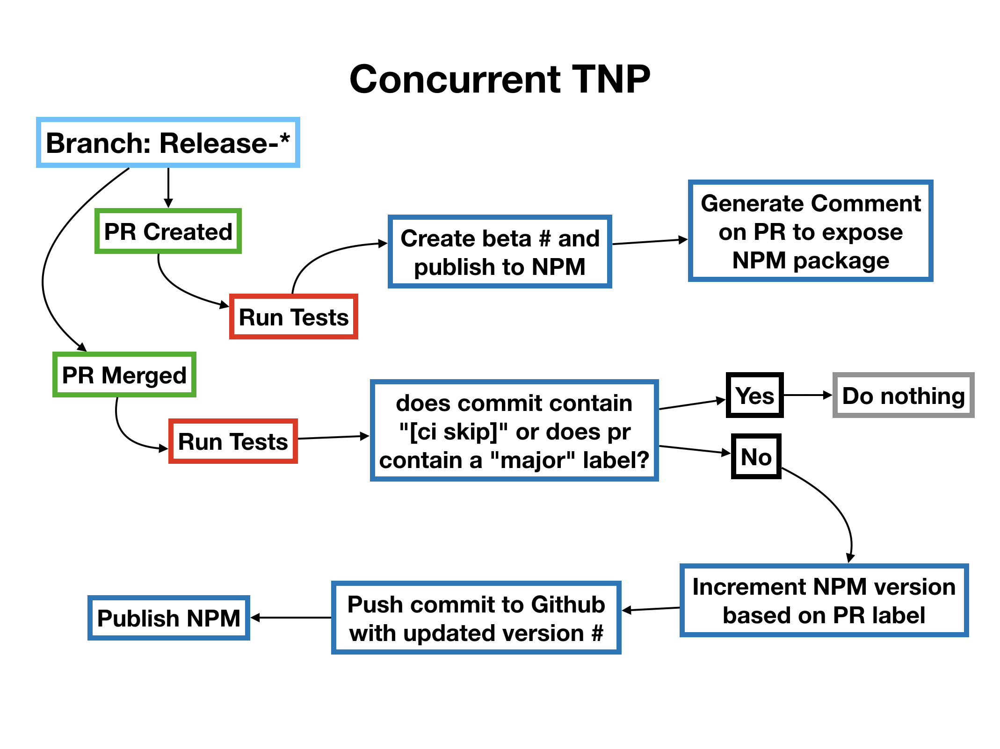

# Checklist
- [x] Tests
- [x] Committing
- [x] Publishing

# Questions
- [ ] Use a Docker account?
  - [ ] vs using CLI to install the files onto the repo
- [ ] Monorepo?
  - [ ] Purpose is to install it once and applied to all its children?
  - [ ] Alternative is to install per repo in an organization?
- [ ] How to make lint/test/coverage settings suitable for any repos?

# Setup Instructions
1. Add the following in secrets:
    - DANGER_GITHUB from bot token (public repo)
    - NPM_AUTH_TOKEN from npmjs
    - MK_TOKEN from github for auto-commits (update token name. pr-merge.yml)
    - optional: SEMVER_USER_NAME / SEMVER_USER_EMAIL 
      (if not supplied then git config will take information from `package.json`)
      
2. customize test jobs in both workflows